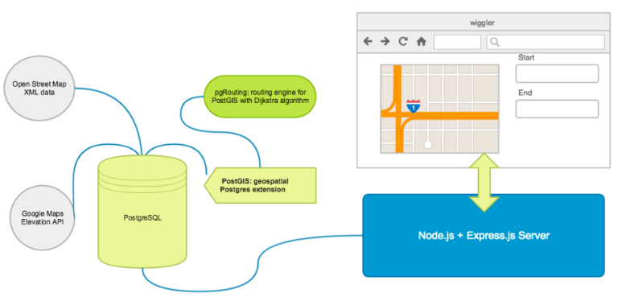

# Wiggler
===

Wiggler is an elevation-aware routing application that allows users to find routes in San Francisco that:

1. minimize total elevation change between point A and point B
2. minimize total distance (i.e. finds the shortest path from A to B)
3. find the fastest biking route from A to B using a physical model of biking velocity
4. find the fastest walking route from A to B using Tobler's hiking function
5. find a loop route (A to A) for a user-defined distance that minimizes elevation changes

We are deployed at [wigglersf.com](http://www.wigglersf.com)

You can find out more about the engineering team [here](http://www.wigglersf.com/#/about)

## Methodology
===
We do all route-finding on our own database server without external API calls. This is possible due to the PostGIS and pgRouting extensions to PostgreSQL. 

We used the pgRouting implementation of [Dijkstra's algorithm](https://en.wikipedia.org/wiki/Dijkstra%27s_algorithm) 

## Architecture
===

## Tech Stack
===

## Contribute
===
Thank you for taking interest in contributing! Please read our [CONTRIBUTE.md](https://github.com/HackerJAMS/wiggler/blob/master/docs/_CONTRIBUTING.md) for specifics on how to contribute.
