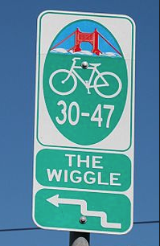
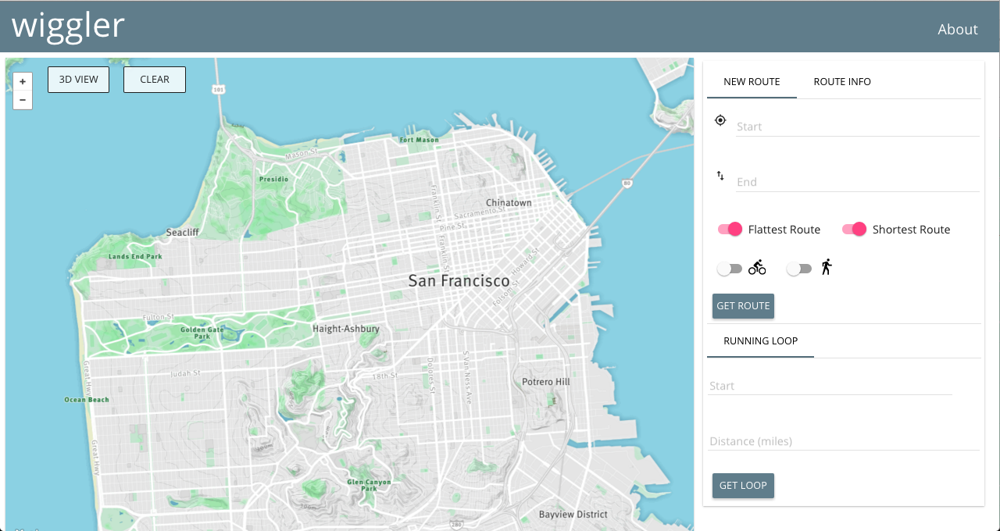
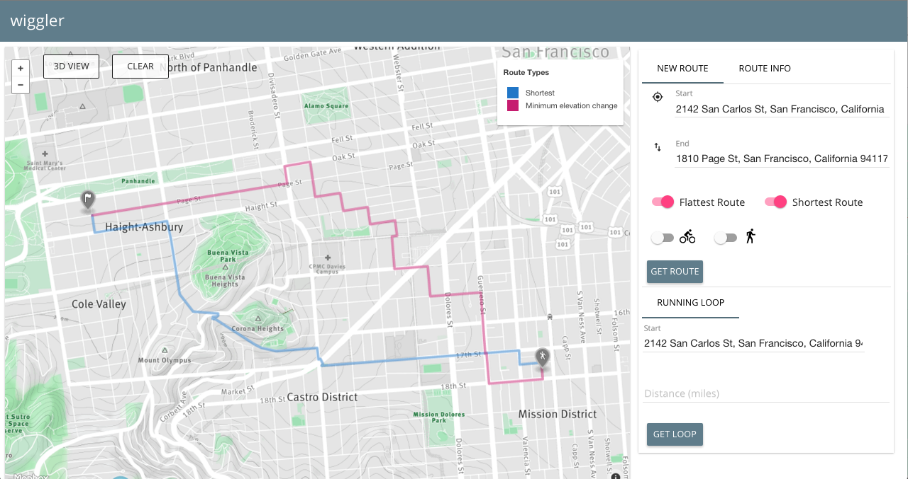
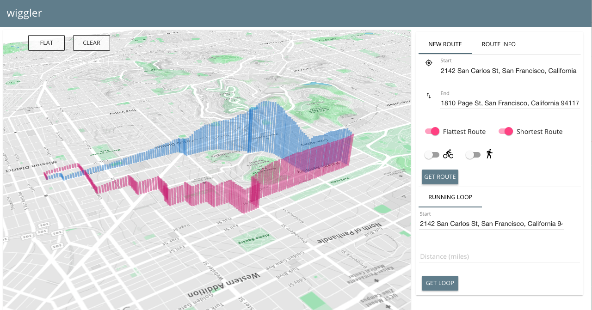
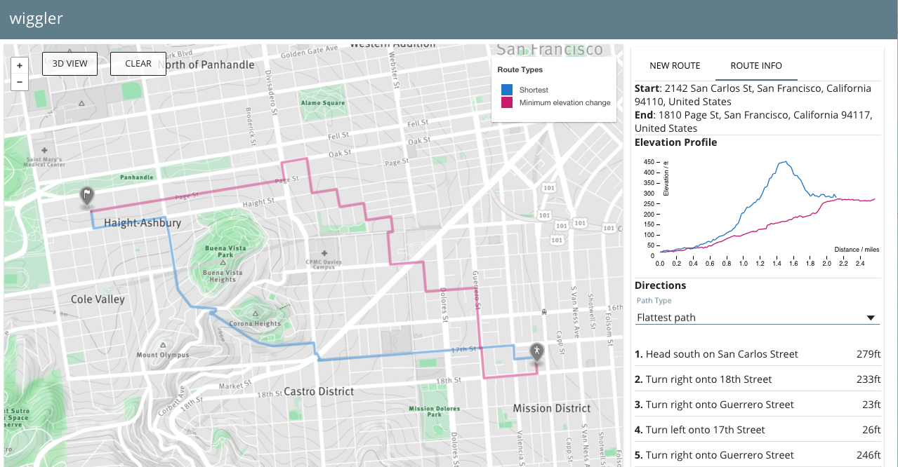
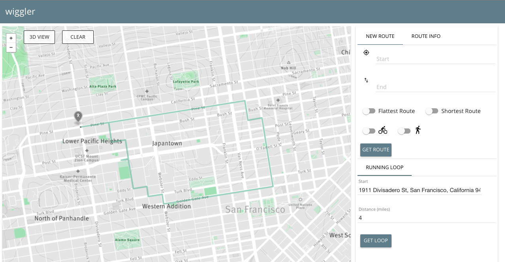

# [wiggler](http://www.wigglersf.com)

[](https://travis-ci.org/falconater/ThesisProject)



Inspired by the well-traveled bike path in San Francisco affectionately named 'the wiggle',
wiggler is an elevation-aware routing application that allows users to find routes in San Francisco that:

1. minimize total elevation change between point A and point B
2. minimize total distance (i.e. finds the shortest path from A to B)
3. find the fastest biking route from A to B using a physical model of biking velocity
4. find the fastest walking route from A to B using Tobler's hiking function
5. find a loop route (A to A) for a user-defined distance that minimizes elevation changes

We are deployed at [wigglersf.com](http://www.wigglersf.com)

You can find out more about the engineering team [here](http://www.wigglersf.com/#/about) or on our contributor page.
## Screenshots

#####Landing page: 


#####Two of four total possible routes displayed


#####3d perspective of the same routes


#####Turn by turn directions and D3 visualization of elevation profiles


#####Loop running/biking route with same start and end point



## Methodology

We do all route-finding on our own database server without external API calls. This is possible due to the PostGIS and pgRouting extensions to PostgreSQL. 

First, we imported the XML map data of San Francisco from OpenStreetMap. We then populated 1.8 million nodes with elevation data from Google Maps Elevation API. 

We used the pgRouting implementation of [Dijkstra's algorithm](https://en.wikipedia.org/wiki/Dijkstra%27s_algorithm) customized with different cost functions to fit the various use cases described above. 

We developed three different cost functions, with the classic distance-as-cost implementation making four total routes for A to B travel.

#### Flattest path function
Our flattest path function minimizes total elevation change and does not take distance travelled into account, allowing for our most leisurely but lengthy routes through the city. 

We do this by calculating the change in elevation and dividing by the distance travelled for each space between nodes in our graph:

``` js
cost = abs(elevation[node_index] - elevation[node_index+1]) / distance(node_index, node_index+1)
```

### Fastest walking path
We used physical models to estimate the velocity of travel for the average human on foot and used that metric as the cost for the fastest walking route. 

Specifically, we used [Tobler's hiking function](https://en.wikipedia.org/wiki/Tobler%27s_hiking_function) which considers that while a slight negative incline causes a moderately faster pace, any dramatic negative in incline slows walkers down similarly to any steep incline. 

```
cost = distance between nodes / velocity from Tobler's function
```

### Fastest biking path
For biking, our model was much more complex as there many forces at work when one is traveling by bicycle. We used a model developed by computational cyclist Steve Gribble. You can take a look at the details [here](http://www.gribble.org/cycling/power_v_speed.html).

We modified it slightly to standardize it for an average human who weighs 75kg and exerts approximately 60 watts of power when riding, and then calculated the estimated velocity depending on the elevation grade. Because the equation is a cubic polynomial function, Gribble's model uses a binary search approach to approximating the velocity of travel. 

```
cost = distance between nodes / velocity from Gribble's model
```

### Loop routing
We wanted to be able to provide a semi-circular route for cyclists and runners wishing to go for leisurely jogs/rides without climbing too many of SF's infamous hills. 

The method that worked best after quite a bit of trial-and-error was the following:

1. find all nodes that are between 1/3 and 1/2 of the requested distance away (e.g if you wanted to go for a 3 mile run, we pulled all nodes between 1 - 1.5 miles from the start point)
2. run pgRouting's k-dijkstra paths algorithm on the set of nodes returned from step 1, and choose the node (out-node) with the smallest total cost
3. use the dijkstra algorithm once more, but this time weighting the cost by the inverse distance from the out-path, forcing the return route to veer away from the original route and thus provide a true "loop." 

## Architecture


## Tech Stack


## Contribute

Thank you for taking interest in contributing! Please read our [CONTRIBUTE.md](https://github.com/HackerJAMS/wiggler/blob/master/docs/_CONTRIBUTING.md) for specifics on how to contribute.
