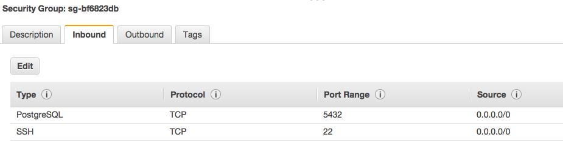

## Setting up AWS RDS instance

### connect to the db:


```bash

pg_dump -Fc -o [dbname in psql] > test_gis

psql --host=jams-testdb.cixgk6ztii6j.us-east-1.rds.amazonaws.com --port=5432 --username=jams_mks25 --password --dbname=testing
```

```sql
## in db test_gis

CREATE EXTENSION postgis;
CREATE EXTENSION postgis_topology;
CREATE EXTENSION hstore;
GRANT ALL PRIVILEGES ON DATABASE test_gis to jams_mks25;
\q
```
```bash
pg_restore --host=jams-testdb.cixgk6ztii6j.us-east-1.rds.amazonaws.com --port=5432 --username=jams_mks25 -n public --password --dbname=sf_gis test_gis --no-owner --no-privileges --no-tablespaces
```

## Setting up AWS EC2 PostgreSQL instance
#### warning this implementation is NOT secure -- do not use for production

1. create an amazon ec2 instance with an Ubuntu linux server image
2. make sure your amazon security group is set up to allow psql to have remote connections




```bash
##connect to the remote server instance
ssh -i Documents/makersquare/thesis/spatial_sandbox/jams.pem ubuntu@ ec2-52-34-24-220.us-west-2.compute.amazonaws.com


sudo apt-get update
sudo apt-get install postgresql postgresql-contrib

## check your psql installation
sudo su postgres
psql
## you should get a command prompt like
postgres=# 
##some psql commands
\l+ ## see all db and their size
\d ## describe all tables in current db
\dx ## describe all current installed extensions
\c DBNAME ## connect to a given db
\q ## quit

## install postgis and dependencies
sudo apt-get install -y postgis postgresql-9.3-postgis-2.1

## add pgrouting
sudo add-apt-repository ppa:ubuntugis/ppa
sudo add-apt-repository ppa:georepublic/pgrouting
sudo apt-get update
sudo apt-get install postgresql-9.3-pgrouting postgresql-9.3-postgis-2.1
sudo apt-get install osm2pgrouting

## test your extensions -- if you don't get an error you're good!
sudo -u postgres psql -c "create extension postgis;"
sudo -u postgres psql -c "create extension postgis_topology;"
sudo -u postgres psql -c "create extension pgrouting;"

## log into psql and create a database with these extensions enabled
sudo su postgres
psql 
create database DB_NAME;
create extension postgis;
create extension postgis_topology;
create extension pgrouting;
\q


## find where your config file is, change METHOD from md5 to trust for these lines
## should look like this
##  host     all     all     127.0.0.1/32    trust
## host     all     all     ::1/128     trust

## in my case the config file was at the path below
sudo vim /etc/postgresql/9.3/main/pg_hba.conf 
# to connect from remote server, add a new line with YOURIP/24
host all all 173.247.204.106/24 trust
# or if you want to trust all servers:
host all all 0.0.0.0/24 trust
## :wq to save your changes

### in postgresql.conf:
listen_addresses = '*'
:wq
$ sudo service postgresql restart
## download map data
cd
mkdir data
cd data
curl http://overpass-api.de/api/map?bbox=-122.5903,37.6626,-122.2713,37.8318 >> osm_sf.osm

## restart the server using pg_ctl
## you first need to set up some environment variables so that the image knows where to look for the pg utils
sudo su postgres
export PATH=$PATH:/usr/lib/postgresql/9.3/bin/
export PGDATA=/var/lib/postgresql/9.3/main
pg_ctl reload

## load in .osm file to the new postgres db with postgis and pgrouting enabled
osm2pgrouting -file /home/ubuntu/data/osm_sf.osm \
-host ec2-52-33-5-195.us-west-2.compute.amazonaws.com \
-port 5432 \
-dbname sf_routing \
-user postgres \
-conf /usr/share/osm2pgrouting/mapconfig.xml \
-clean 

## type exit until you're back on your own localhost
exit
exit

select sum(oldCount-1) from (select count(*) as oldCount from elevation_test group by round_lat, round_lon having count(*)>1) m;

#to test the connection from your local computer:
psql --host=ec2-52-34-24-220.us-west-2.compute.amazonaws.com --port=5432 --dbname=sf_routing --username=postgres

psql --host=104.154.80.252 --port=5432 --username=postgres
## to  restart
sudo service postgresql restart
```

https://cloud.google.com/solutions/setup-postgres

